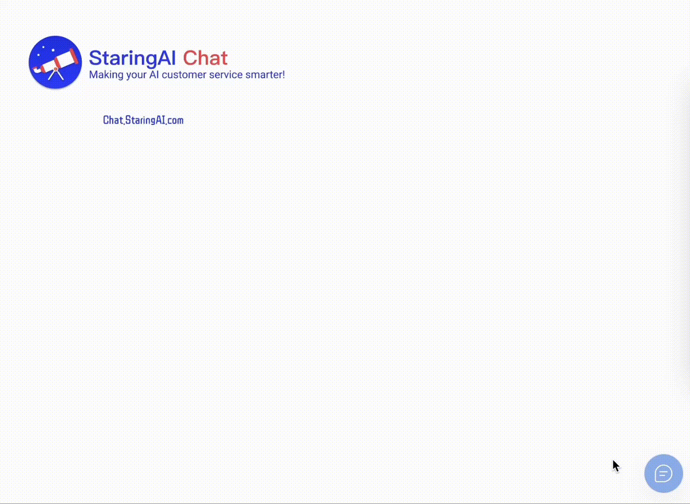

<div align="center">
  <a href="https://chat.staringos.com/?f=mbrm">免费使用</a> | <a href="https://staringos.com?f=mbrm">官网</a> ｜ <a href="https://github.com/staringos">Github</a> | <a href="https://staringos.feishu.cn/wiki/OVBOw76u8iBOIGk8KW6cOV1fnVh">Document</a>
</div>
<br />
<div align="center">

[](https://github.com/staringos/mtbird)
[](https://github.com/staringos/mtbird/releases)
[](https://github.com/staringos/mtbird/pulls)

</div>

# StaringAI Chat

让你的网站一键拥有 ChatGPT 客服 —— 星搭云智慧客服

[English](./README.md)



<p></p>

## 特点

- 🔌 无缝集成和易于使用：只需一行代码即可将客服机器人添加到网站，简单安装和最小配置，快速上手。

- 🤖 自定义客服助手：在[星搭小星](https://staringai.com/)上自定义助手，包括上传自己的知识库供助手学习、自定义问题和回复、自定义预置问题。

- 🎨 外观定制：在[星搭](https://mtbird.staringos.com/)中自定义助手的外观和界面。

## 快速开始

需要 NodeJS 版本: >=16.13.2

```shell
git clone https://github.com/staringos/staringai-chat-sdk
yarn install
yarn dev
```

在浏览器打开: http://localhost:1234/

## Join Group


