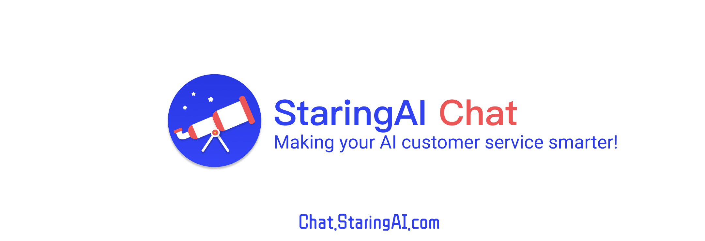
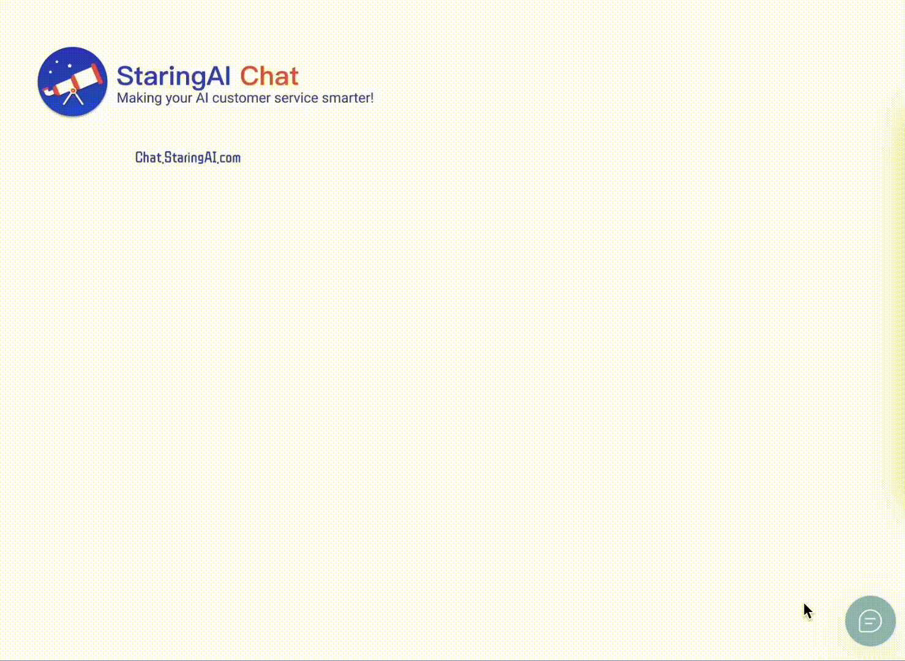

<div align="center">
  <a href="https://chat.staringos.com/?f=mbrm">Use for free</a> | <a href="https://staringos.com?f=mbrm">Website</a> ｜ <a href="https://github.com/staringos">Github</a> | <a href="https://staringos.feishu.cn/wiki/OVBOw76u8iBOIGk8KW6cOV1fnVh">Document</a>
</div>
<br />
<div align="center">

[](https://github.com/staringos/mtbird)
[](https://github.com/staringos/mtbird/releases)
[](https://github.com/staringos/mtbird/pulls)
[](https://discord.gg/7V5vnHW2)

</div>

# StaringAI Chat

Give your website ChatGPT customer service with one click

[中文文档](./README-CN.md)



<p></p>

## Features

- 🔌 Seamless Integration and Easy to Use: Add the chatbot to your website with minimal configuration and a simple installation process. It's quick and easy to get started.

- 🤖 Customizable Assistant: Customize your customer service assistant on [StaringAI](https://staringai.com/), including uploading your own knowledge base for the assistant to learn from, customizing questions and responses, and setting up predefined questions.

- 🎨 Appearance Customization: Customize the look and feel of your customer service chatbot on [Staring](https://mtbird.staringos.com/).

## Getting Start

Require NodeJS version: >=16.13.2

```shell
git clone https://github.com/staringos/staringai-chat-sdk
yarn install
yarn dev
```

Open: http://localhost:1234/

## Join Group


